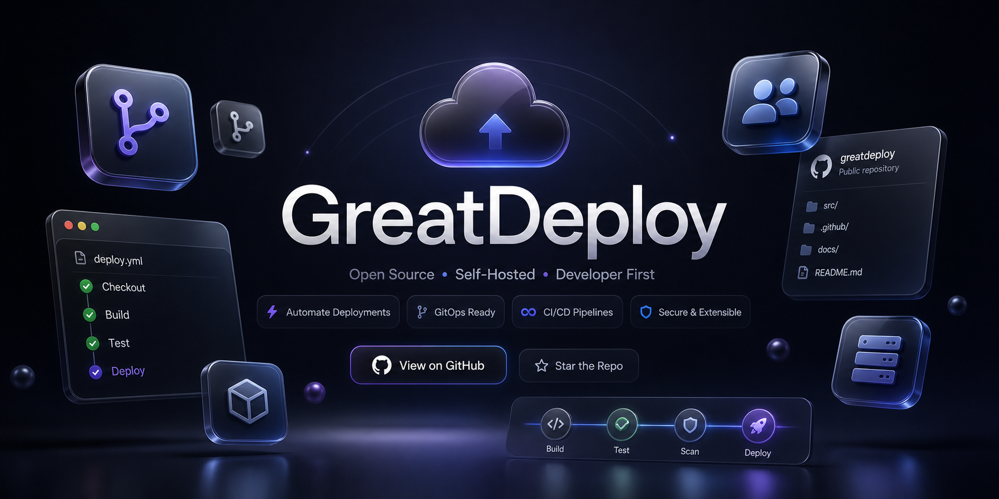

# Great Deploy

<p align="center">
  
</p>

<p align="center">
  <a href="README.md">English</a> | <a href="README_vi.md">Tiếng Việt</a> | <a href="README_zh.md">中文</a>
</p>

<p align="center">
  <strong>Ứng dụng Menu Bar macOS native giúp chuyển đổi mượt mà giữa nhiều profile lập trình viên (GitHub + Cloudflare)</strong>
</p>

<p align="center">
  <a href="#tính-năng">Tính năng</a> |
  <a href="#cài-đặt">Cài đặt</a> |
  <a href="#sử-dụng">Sử dụng</a> |
  <a href="#cách-hoạt-động">Cách hoạt động</a> |
  <a href="#xử-lý-sự-cố">Xử lý sự cố</a>
</p>

---

## 🛑 Vấn đề

Việc phải tung hứng giữa nhiều danh tính lập trình viên thực sự là một cơn đau đầu. Cho dù bạn đang chuyển đổi giữa tài khoản GitHub **Cá nhân**, **Công việc** hay **Khách hàng**, việc cập nhật thủ công `git config`, quản lý các Personal Access Token (PAT) khác nhau và hoán đổi thông tin đăng nhập Cloudflare tốn rất nhiều thời gian và dễ dẫn đến những pha commit nhầm tài khoản đầy bối rối.

## 🚀 Giải pháp

**Great Deploy** là bộ chuyển đổi ngữ cảnh chỉ với 1 click chuột của bạn. Nằm gọn gàng trên menu bar macOS, nó cho phép bạn chuyển đổi toàn bộ môi trường lập trình của mình ngay lập tức. 

Chỉ với 1 click, Great Deploy sẽ:
1. Hoán đổi thông tin đăng nhập GitHub của bạn một cách bảo mật trong macOS Keychain.
2. Cập nhật `git config user.name` và `user.email` global.
3. Đưa đúng Cloudflare API token vào file `~/.wrangler/config/default.toml` và môi trường `launchctl` của macOS.

Không cần múa phím trên terminal nữa. Chào tạm biệt những lần commit nhầm tài khoản.

## Tính năng

- **Giao diện Menu Bar** - Sẵn sàng trên thanh menu bar để truy cập tức thì
- **Chuyển đổi 1-Click** - Đổi profile lập trình viên (GitHub + Cloudflare) chỉ bằng một cú click
- **Tích hợp Keychain** - Tự động cập nhật thông tin xác thực vào macOS Keychain một cách an toàn
- **Quản lý Git Config** - Cập nhật `git config --global user.name` và `user.email`
- **Tích hợp Cloudflare** - Quản lý `CLOUDFLARE_API_TOKEN` và `CLOUDFLARE_ACCOUNT_ID` trong `~/.wrangler/config/default.toml` cũng như môi trường launchctl
- **Lưu trữ bảo mật** - PAT và API Token được lưu an toàn trong Keychain (không bao giờ lưu plain text)
- **Khởi động cùng hệ thống** - Có tùy chọn tự động chạy khi đăng nhập
- **Thông báo Native** - Nhận thông báo mỗi khi chuyển tài khoản thành công
- **Không có icon ở Dock** - Chạy ngầm giống như một tiện ích hệ thống (chỉ có trên menu bar)
- **Hỗ trợ Dark Mode** - Thay đổi giao diện theo cài đặt hệ thống của bạn

## Yêu cầu hệ thống

- **macOS 13.0** (Ventura) trở lên
- **Xcode 15.0** trở lên (nếu bạn muốn build từ mã nguồn)
- **Git** đã được cài đặt (thường ở `/usr/bin/git` hoặc qua Homebrew)
- **Wrangler / Cloudflare CLI** (tùy chọn, để deploy lên Cloudflare)

## Cài đặt

### Bản ad-hoc để chia sẻ giữa các máy cá nhân

Dùng cách này khi bạn muốn tạo bản miễn phí để copy sang máy Mac khác, không cần Apple Developer ID:

```bash
make package-ad-hoc
```

File package sẽ nằm trong `dist/` với tên `GreatDeploy-<version>-macos-ad-hoc.zip`. App được ký ad-hoc và không notarized, nên lần mở đầu tiên có thể cần right-click -> **Open** hoặc vào **System Settings -> Privacy & Security -> Open Anyway**.

Nếu macOS báo app bị damaged sau khi copy vào `/Applications`, chạy:

```bash
xattr -cr /Applications/GreatDeploy.app
open /Applications/GreatDeploy.app
```

Xem thêm `docs/INSTALL_ADHOC.md`; file này cũng được đóng gói kèm trong ZIP.

### Cách 1: Build từ Terminal (Khuyên dùng)

```bash
# Clone repository
git clone https://github.com/MinhOmega/GreatDeploy.git
cd GreatDeploy/GreatDeploy

# Lệnh rút gọn (Clean Build & Install)
xcodebuild -project GreatDeploy.xcodeproj -scheme GreatDeploy clean && \
rm -rf ~/Library/Developer/Xcode/DerivedData/GreatDeploy-* && \
xcodebuild -project GreatDeploy.xcodeproj -scheme GreatDeploy -configuration Release build && \
rm -rf /Applications/GreatDeploy.app && \
cp -R ~/Library/Developer/Xcode/DerivedData/GreatDeploy-*/Build/Products/Release/GreatDeploy.app /Applications/ && \
open /Applications/GreatDeploy.app
```

### Cách 2: Build bằng Xcode

1. Mở `GreatDeploy.xcodeproj` bằng Xcode.
2. Chọn **Development Team** của bạn ở mục Project Settings > Signing & Capabilities.
3. Chọn **Product > Archive** (để tạo bản Release) hoặc bấm **Cmd+R** để build và chạy.

## Sử dụng

1. Click vào icon trên menu bar và chọn **"Add Account"** (hoặc dấu **+**).
2. Điền thông tin profile (Display Name, GitHub Username, Personal Access Token, Git Name, Git Email, và thông tin Cloudflare nếu có).
3. Sau khi thêm, bạn có thể click chọn bất kỳ tài khoản nào từ menu bar. Great Deploy sẽ ngay lập tức thay đổi toàn bộ Git config và Keychain tương ứng với tài khoản đó.

## Cách tạo Personal Access Token (PAT)

1. Truy cập [GitHub Settings > Developer settings > Personal access tokens](https://github.com/settings/tokens).
2. Tạo Token mới (Fine-grained hoặc Classic).
   - Với Classic: Chọn quyền `repo`, `read:user`, `user:email`.
   - Với Fine-grained: Chọn quyền đọc/ghi cho Contents và Metadata.
3. Sao chép Token (bạn chỉ thấy nó 1 lần duy nhất) và dán vào Great Deploy.

## Bảo mật

Great Deploy **không áp dụng Sandbox** bởi vì ứng dụng cần truy cập toàn quyền vào Keychain, thực thi lệnh `git` qua shell và ghi file `~/.gitconfig` - những điều mà Sandbox mặc định của Apple App Store không cho phép.

- Token được mã hóa trong macOS Keychain.
- Không có bất kỳ log file hay UserDefaults nào lưu trữ token ở dạng văn bản thuần (plain text).
- Token của mỗi tài khoản được lưu tách biệt.

## Lời cảm ơn

**Cảm ơn đặc biệt**: Great Deploy là phiên bản nâng cấp toàn diện từ ứng dụng gốc **GitAccountSwitcher**. Chúng tôi gửi lời cảm ơn chân thành đến các tác giả ban đầu (bao gồm MinhOmega) đã cung cấp nền tảng mã nguồn mở và ý tưởng tuyệt vời về tích hợp Keychain để biến công cụ này thành hiện thực.
