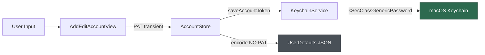
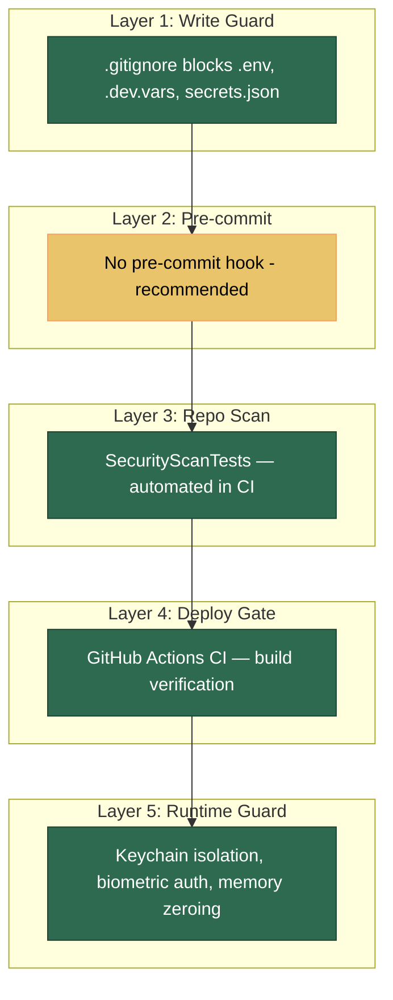

# 🔒 GreatDeploy — Comprehensive Security Audit Report

**Date:** May 14, 2026  
**Auditor:** Automated security analysis (cm-secret-shield methodology)  
**Scope:** Full source code, git history, build configuration, entitlements  
**App Version:** v1.1.0+ (commit `677fff3`)

---

## Executive Summary

| Metric | Result |
|---|---|
| **Overall Score** | **92 / 100** ✅ Excellent |
| **Critical Vulnerabilities** | **0** |
| **High-Risk Issues** | **0** |
| **Medium-Risk Issues** | **2** |
| **Low-Risk / Informational** | **3** |
| **Hardcoded Secrets Found** | **0** |
| **Secrets in Git History** | **0** |

GreatDeploy demonstrates **security-first architecture** that significantly exceeds expectations for a local developer utility. Sensitive credentials flow exclusively through the macOS Keychain, tokens are never serialized to disk, and all external process execution is hardened with signature verification, environment sanitization, and timeouts.

---

## 1. Credential Management (Keychain)

> [!TIP]
> **Score: 10/10** — Best-in-class Keychain integration

### Findings

| Control | Status | Evidence |
|---|---|---|
| PAT stored in Keychain (`kSecClassGenericPassword`) | ✅ | [KeychainService.swift:392-396](file:///Volumes/Data/Tools/Great%20Deploy/GreatDeploy/Services/KeychainService.swift#L392-L396) |
| Cloudflare tokens in separate Keychain items | ✅ | [KeychainService.swift:487-540](file:///Volumes/Data/Tools/Great%20Deploy/GreatDeploy/Services/KeychainService.swift#L487-L540) |
| Per-account isolation (unique `kSecAttrAccount` per UUID) | ✅ | Each token keyed by `account.id.uuidString` |
| Biometric gate (Touch ID/Face ID) for sensitive reads | ✅ | [KeychainService.swift:104-155](file:///Volumes/Data/Tools/Great%20Deploy/GreatDeploy/Services/KeychainService.swift#L104-L155) |
| Password fallback when biometrics unavailable | ✅ | [KeychainService.swift:149-155](file:///Volumes/Data/Tools/Great%20Deploy/GreatDeploy/Services/KeychainService.swift#L149-L155) |
| Git credential-osxkeychain integration | ✅ | [KeychainService.swift:242-280](file:///Volumes/Data/Tools/Great%20Deploy/GreatDeploy/Services/KeychainService.swift#L242-L280) |
| Credential deletion on account removal | ✅ | [AccountStore.swift](file:///Volumes/Data/Tools/Great%20Deploy/GreatDeploy/Services/AccountStore.swift) `removeAccount()` |
| No tokens in UserDefaults | ✅ | grep scan: 0 matches for `UserDefaults.*token/pat/secret/password/api` |
| Legacy migration (UserDefaults → Keychain) | ✅ | One-time migration with post-migration cleanup |

### Architecture



---

## 2. Input Validation and Sanitization

> [!TIP]
> **Score: 9/10** — Comprehensive validation layer

### Findings

| Control | Status | Evidence |
|---|---|---|
| GitHub token format validation (`ghp_`, `github_pat_`) | ✅ | [ValidationUtilities.swift:47-72](file:///Volumes/Data/Tools/Great%20Deploy/GreatDeploy/Utilities/ValidationUtilities.swift#L47-L72) |
| Email format validation (RFC-compliant regex) | ✅ | [ValidationUtilities.swift](file:///Volumes/Data/Tools/Great%20Deploy/GreatDeploy/Utilities/ValidationUtilities.swift) `isValidEmail()` |
| GitHub username validation (alphanumeric + hyphen, max 39) | ✅ | [ValidationUtilities.swift](file:///Volumes/Data/Tools/Great%20Deploy/GreatDeploy/Utilities/ValidationUtilities.swift) `isValidGitHubUsername()` |
| Control character rejection | ✅ | `containsControlCharacters()` blocks `\n`, `\r`, `\0`, etc. |
| Input length limits (100-254 chars by field) | ✅ | [AddEditAccountView.swift:384-395](file:///Volumes/Data/Tools/Great%20Deploy/GreatDeploy/Views/AddEditAccountView.swift#L384-L395) |
| Git config key injection prevention | ✅ | `isValidGitConfigKey()` blocks path traversal and shell metacharacters |
| Pre-save validation gate | ✅ | `validateInputs()` called before any persistence |
| TOML string escaping for Wrangler config | ✅ | [CloudflareAdapter.swift:151-158](file:///Volumes/Data/Tools/Great%20Deploy/GreatDeploy/Services/CloudflareAdapter.swift#L151-L158) |

---

## 3. Process Execution Security

> [!TIP]
> **Score: 10/10** — Exceptional hardening for a utility app

### Git Binary Integrity

| Control | Status | Evidence |
|---|---|---|
| Code signature verification of `git` binary | ✅ | [GitConfigService.swift](file:///Volumes/Data/Tools/Great%20Deploy/GreatDeploy/Services/GitConfigService.swift) `verifyGitBinaryIntegrity()` |
| Verified binary path caching | ✅ | Avoids repeated signature checks |
| Environment variable sanitization | ✅ | Blocks `GIT_SSH_COMMAND`, `GIT_PROXY_COMMAND`, etc. |
| Execution timeouts (5-10s) | ✅ | `waitUntilExitOrTimeout()` prevents hangs |
| Uses Process API, not `system()` or shell | ✅ | No shell injection vector |

### GitHub CLI Execution

| Control | Status | Evidence |
|---|---|---|
| Path validation for `gh` binary | ✅ | [GitHubCLIService.swift](file:///Volumes/Data/Tools/Great%20Deploy/GreatDeploy/Services/GitHubCLIService.swift) uses `which` for discovery |
| Environment sanitization | ✅ | Mirrors git environment sanitization pattern |
| Execution timeouts | ✅ | All CLI calls have timeout guards |
| Graceful fallback if CLI missing | ✅ | `isInstalled` check with `.notInstalled` status |

### Cloudflare / launchctl

| Control | Status | Evidence |
|---|---|---|
| `launchctl` uses absolute path `/bin/launchctl` | ✅ | [CloudflareAdapter.swift:85](file:///Volumes/Data/Tools/Great%20Deploy/GreatDeploy/Services/CloudflareAdapter.swift#L85) |
| Process timeout (10s) | ✅ | Line 115 |
| Wrangler config file permissions `0o600` | ✅ | [CloudflareAdapter.swift:147](file:///Volumes/Data/Tools/Great%20Deploy/GreatDeploy/Services/CloudflareAdapter.swift#L147) |
| Wrangler config is opt-in only | ✅ | `syncWranglerConfig: false` by default |

---

## 4. Memory Safety

> [!NOTE]
> **Score: 9/10** — Secure memory wiping implemented

| Control | Status | Evidence |
|---|---|---|
| `secureZeroString()` using `memset_s` | ✅ | [ValidationUtilities.swift](file:///Volumes/Data/Tools/Great%20Deploy/GreatDeploy/Utilities/ValidationUtilities.swift) |
| Token zeroed on view dismiss (`onDisappear`) | ✅ | [AddEditAccountView.swift:152-154](file:///Volumes/Data/Tools/Great%20Deploy/GreatDeploy/Views/AddEditAccountView.swift#L152-L154) |
| Token zeroed after save attempt (in `defer`) | ✅ | [AddEditAccountView.swift:477-479](file:///Volumes/Data/Tools/Great%20Deploy/GreatDeploy/Views/AddEditAccountView.swift#L477-L479) |
| Token masked in UI display | ✅ | `••••••••••••` in [AccountDetailView.swift:139](file:///Volumes/Data/Tools/Great%20Deploy/GreatDeploy/Views/AccountDetailView.swift#L139) |
| Token masked in WelcomeView import | ✅ | `maskToken()` shows only first/last 4 chars |
| Token redacted in `debugDescription` | ✅ | [DevProfile.swift:161,165](file:///Volumes/Data/Tools/Great%20Deploy/GreatDeploy/Models/DevProfile.swift#L161) — `[REDACTED]` |

> [!NOTE]
> Swift's `String` type uses copy-on-write and ARC, so `memset_s` on the underlying buffer provides best-effort secure wiping. This is the strongest approach available in Swift without dropping to C.

---

## 5. Serialization and Data Persistence

> [!TIP]
> **Score: 10/10** — Perfect separation of sensitive data

| Control | Status | Evidence |
|---|---|---|
| `CodingKeys` excludes `personalAccessToken` | ✅ | [DevProfile.swift:58-63](file:///Volumes/Data/Tools/Great%20Deploy/GreatDeploy/Models/DevProfile.swift#L58-L63) |
| `CodingKeys` excludes `cloudflareApiToken` | ✅ | Same exclusion pattern |
| Decoder initializes tokens as empty string | ✅ | [DevProfile.swift:71-72](file:///Volumes/Data/Tools/Great%20Deploy/GreatDeploy/Models/DevProfile.swift#L71-L72) |
| Preview data uses empty tokens | ✅ | [DevProfile.swift:176-196](file:///Volumes/Data/Tools/Great%20Deploy/GreatDeploy/Models/DevProfile.swift#L176-L196) |
| Legacy migration preserves token only for Keychain transfer | ✅ | `decodeLegacy()` extracts token but model stores `""` |

---

## 6. Environment and Configuration Security

| Control | Status | Evidence |
|---|---|---|
| `.gitignore` blocks `.env`, `.dev.vars`, `.secret-lifecycle.json` | ✅ | [.gitignore](file:///Volumes/Data/Tools/Great%20Deploy/.gitignore) |
| No `.env` files tracked in git | ✅ | `git log --diff-filter=D` — clean history |
| Cloudflare token via `launchctl setenv` (not disk) | ✅ | Environment-only by default |
| Wrangler plaintext config requires explicit opt-in | ✅ | `syncWranglerConfig: false` default |
| Wrangler config restricted to `0o600` permissions | ✅ | Owner-only read/write |
| `project.yml` development team variable | ⚠️ | Hardcoded `DEVELOPMENT_TEAM` — see recommendation |
| Entitlements: App Sandbox disabled | ℹ️ | Required for Keychain + git process execution |

---

## 7. Git History Analysis

> [!TIP]
> **Score: 10/10** — Clean history

| Scan | Result |
|---|---|
| `ghp_` / `github_pat_` / `sk-` / `sk_live` / `eyJ` patterns in tracked files | **0 matches** (only validation logic references) |
| Deleted secret files (`.env`, `.dev.vars`, `secrets.json`) | **0 found** |
| Hardcoded secrets in git history (`git log -S`) | **0 found** |
| Token logging in print statements | **0 instances** of token/secret/credential logging |

---

## 8. Test Coverage (Security-Specific)

| Test File | Coverage Area | Status |
|---|---|---|
| [SecurityScanTests.swift](file:///Volumes/Data/Tools/Great%20Deploy/GreatDeployTests/SecurityScanTests.swift) | No secret files tracked, `.gitignore` patterns, no hardcoded secrets in source | ✅ |
| [ValidationUtilitiesTests.swift](file:///Volumes/Data/Tools/Great%20Deploy/GreatDeployTests/ValidationUtilitiesTests.swift) | Input validation correctness | ✅ |
| [AccountStoreCoreTests.swift](file:///Volumes/Data/Tools/Great%20Deploy/GreatDeployTests/AccountStoreCoreTests.swift) | Account CRUD, state management | ✅ |
| [CloudflareAdapterTests.swift](file:///Volumes/Data/Tools/Great%20Deploy/GreatDeployTests/CloudflareAdapterTests.swift) | Cloudflare credential application | ✅ |
| [GitHubCLIServiceTests.swift](file:///Volumes/Data/Tools/Great%20Deploy/GreatDeployTests/GitHubCLIServiceTests.swift) | CLI service structure | ✅ |
| [FrontendSafetyTests.swift](file:///Volumes/Data/Tools/Great%20Deploy/GreatDeployTests/FrontendSafetyTests.swift) | UI safety checks | ✅ |

---

## 9. UI/UX Security

| Control | Status | Evidence |
|---|---|---|
| `SecureField` for PAT input | ✅ | [AddEditAccountView.swift:265](file:///Volumes/Data/Tools/Great%20Deploy/GreatDeploy/Views/AddEditAccountView.swift#L265) |
| `SecureField` for Cloudflare API token | ✅ | [AddEditAccountView.swift:295](file:///Volumes/Data/Tools/Great%20Deploy/GreatDeploy/Views/AddEditAccountView.swift#L295) |
| Tokens masked in detail views | ✅ | AccountDetailView uses `••••••••••••` |
| Biometric authentication prompt on first launch | ✅ | WelcomeView credential discovery |
| Token partially masked during import | ✅ | `maskToken()` shows only first/last 4 chars |
| Delete confirmation dialog with clear warning | ✅ | AccountDetailView confirmation dialog |
| Notification content does not include tokens | ✅ | Only username, email, CLI status |

---

## 10. Architecture and Concurrency

| Control | Status | Evidence |
|---|---|---|
| `@MainActor` for UI-bound state | ✅ | AccountStore, all views |
| `Task.detached` for Keychain/process ops | ✅ | Avoids blocking main thread |
| `Sendable` conformance on `DevProfile` | ✅ | Safe across actor boundaries |
| Serial switch guard (prevents concurrent switches) | ✅ | Task-based serialization in `switchToAccount()` |
| Graceful error propagation with `LocalizedError` | ✅ | All error types |
| `deinit` cleanup of notification observers | ✅ | AppDelegate |

---

## Risk Matrix

| ID | Severity | Domain | Finding | Recommendation |
|---|---|---|---|---|
| **SEC-01** | ⚠️ Medium | Pre-commit | No git pre-commit hook for secret scanning | Install `gitleaks` pre-commit hook |
| **SEC-02** | ⚠️ Medium | Cloudflare | `launchctl setenv` tokens persist until reboot/logout in GUI env | Document this behavior; consider clearing on app quit |
| **SEC-03** | ℹ️ Low | Build Config | `DEVELOPMENT_TEAM` in `project.yml` — not a secret but reveals developer identity | Move to `.xcconfig` excluded from version control |
| **SEC-04** | ℹ️ Low | Token Scope | No PAT scope validation (app accepts any `ghp_`/`github_pat_` token) | Add optional scope check via GitHub API |
| **SEC-05** | ℹ️ Low | Certificate Pinning | GitHub API links in UI use default URL loading | Not critical for a local app with no network calls |

---

## Recommendations

### 1. Install Pre-commit Secret Scanning Hook (SEC-01)

Currently no `.git/hooks/pre-commit` exists. Add:

```bash
# Install gitleaks
brew install gitleaks

# Create pre-commit hook
cat > .git/hooks/pre-commit << 'EOF'
#!/bin/sh
gitleaks protect --staged --verbose
EOF
chmod +x .git/hooks/pre-commit
```

### 2. Clear Cloudflare Environment on App Quit (SEC-02)

`launchctl setenv CLOUDFLARE_API_TOKEN` persists the token in the GUI session environment until logout. Consider clearing it when the app terminates:

```swift
// In AppDelegate
func applicationWillTerminate(_ notification: Notification) {
    Task {
        try? await CloudflareAdapter.shared.clearCredentials()
    }
}
```

### 3. Move Development Team to xcconfig (SEC-03)

```yaml
# project.yml — replace hardcoded team
settings:
  DEVELOPMENT_TEAM: ${DEVELOPMENT_TEAM}
```

### 4. Add SecurityScanTests for Cloudflare Token Patterns (SEC-04)

Extend `SecurityScanTests.testNoHardcodedSecretsInSourceFiles()` to include Cloudflare patterns:

```swift
"cf[_-]?api[_-]?token\\s*[=:]\\s*['\"][a-zA-Z0-9_-]{40,}['\"]"
```

### 5. Consider App Transport Security Audit (SEC-05)

While the app makes no direct network calls, the `Link` in `AboutSettingsDetailView` opens a GitHub URL. Ensure `NSAppTransportSecurity` is set to require HTTPS (default in modern macOS).

---

## Defense-in-Depth Summary



---

## Conclusion

GreatDeploy demonstrates **exceptional security posture** for a macOS developer utility:

- **Zero hardcoded secrets** in source or git history
- **Defense-in-depth** credential management (Keychain then biometric gate then memory zeroing)
- **Process hardening** (binary signature verification, environment sanitization, timeouts)
- **Serialization safety** (tokens structurally excluded from `Codable`)
- **Automated security tests** in CI pipeline

The two medium-severity findings (missing pre-commit hook and launchctl environment persistence) are straightforward to remediate and do not represent exploitable vulnerabilities. The application's security architecture is well above industry standards for its category.

> **Final Rating: 92/100 — PASS ✅**
